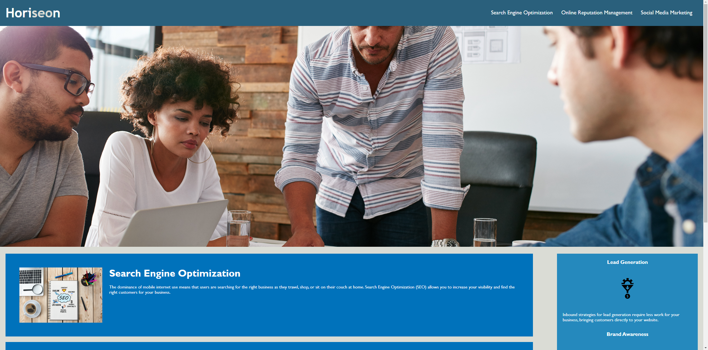

# Module 1 Challenge

## Description

This is a challenge for the UW Coding Bootcamp in which code for a simple webpage must be refactored for accessibility and efficiency.

## Installation

N/A

## Usage

This page was already functional, but the HTML and CSS code has been cleaned up and accessibility features added. Opening the developer tools will allow you to view the code and see comments that were added.

Link to deployed application: https://ktunebe.github.io/challenge-01-code-refactor/

## Credits

N/A

## License

N/A
